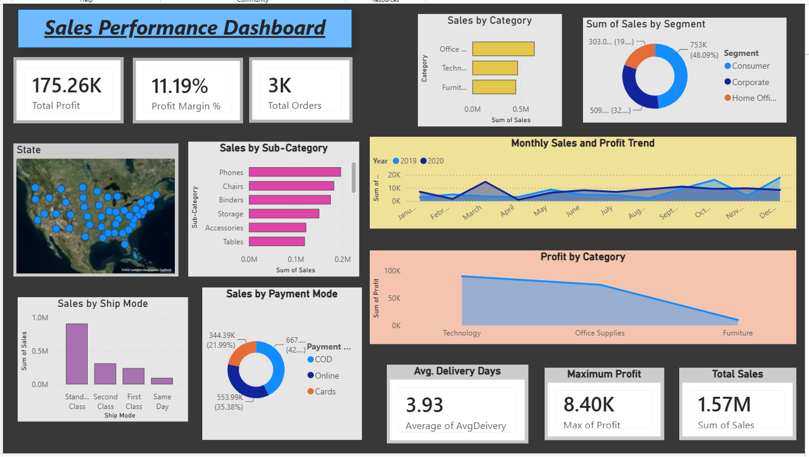

# Power-BI-sales-performance-dashboard
## Project Overview

This project analyzes sales data using Microsoft Power BI
to identify sales trends, product performance, regional
performance, and profitability.

## Tools Used

- Power BI
- Power Query
- DAX
- Excel
- GitHub

## Key Analysis

- Total Sales
- Total Profit
- Total Orders
- Profit Margin
- Sales by Region
- Sales by Category
- Monthly Sales Trend
- Top Products

## Dashboard

## Dataset
The project uses sales transaction data for analysis and visualization.
